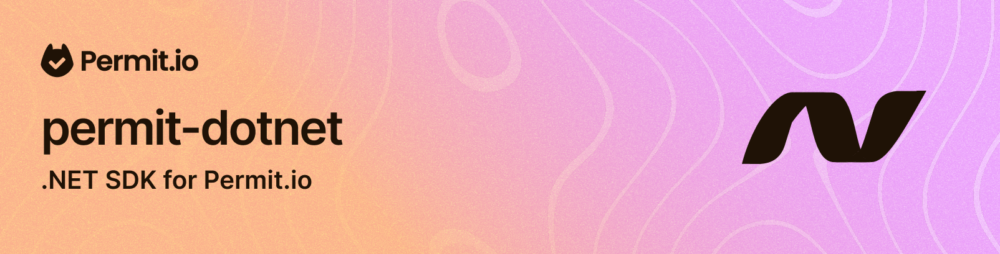


# Permit.io client for dotnet

dotnet client library for the Permit.io full-stack permissions platform.

# To update the API autogenerated code for the Permit.io API

1. Install the latest version of the `OpenAPI Generator` CLI tool from https://openapi-generator.tech/docs/installation
2. Run the following command to generate the PDP client code:
```bash
npm run update-pdp-openapi # this updates the openapi.json file
npm run update-pdp-api # this generates the client code for the Permit.io PDP API
npm run update-status-check-pdp # this checks the status of the PDP API to support also 204 status code (verify that this change looks OK by review the changes)
```

Updating the Permit.io cloud API needs a fix in the openapi.json file first and then it will work in the same way as the PDP API.

## Installation

1. Add the NuGet package to your project:
```bash
dotnet add package Permit
```

2. Import the necessary namespaces:
```csharp
using Permit;
using Permit.Models;
```
